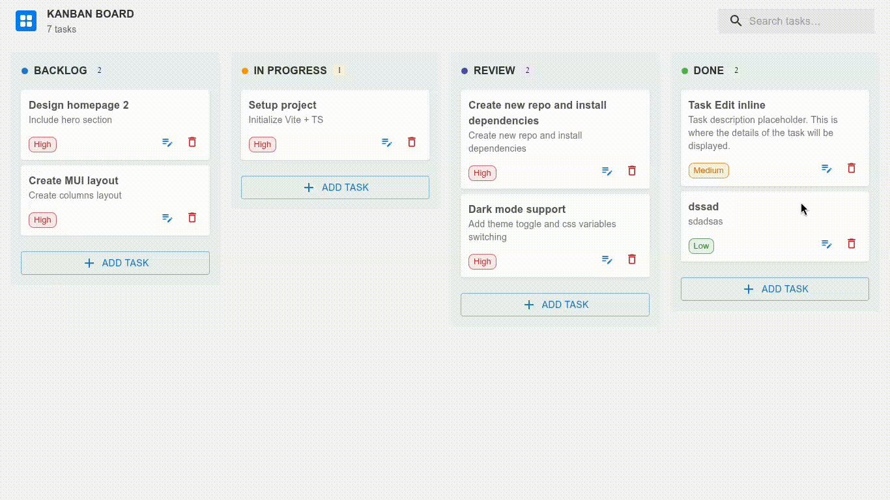
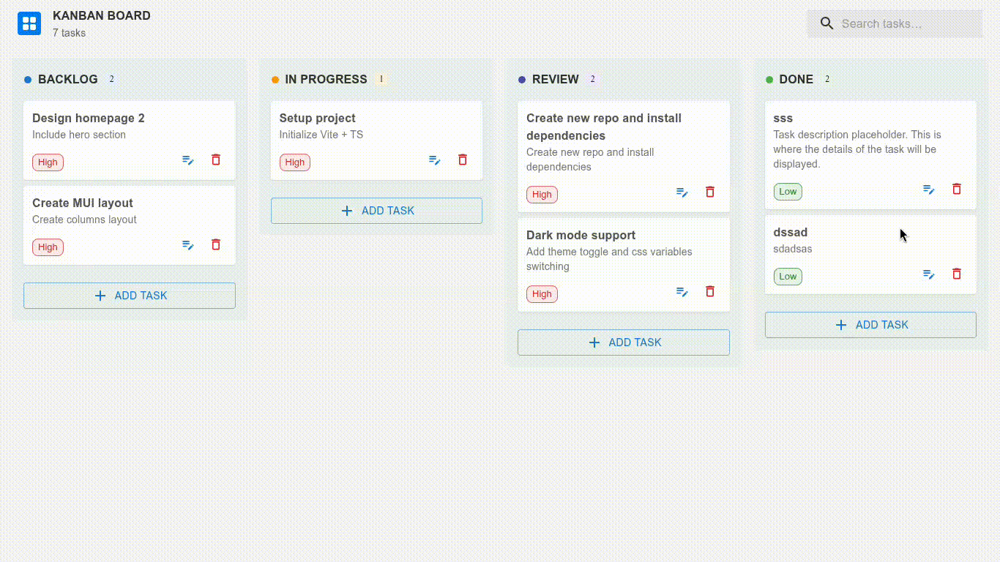
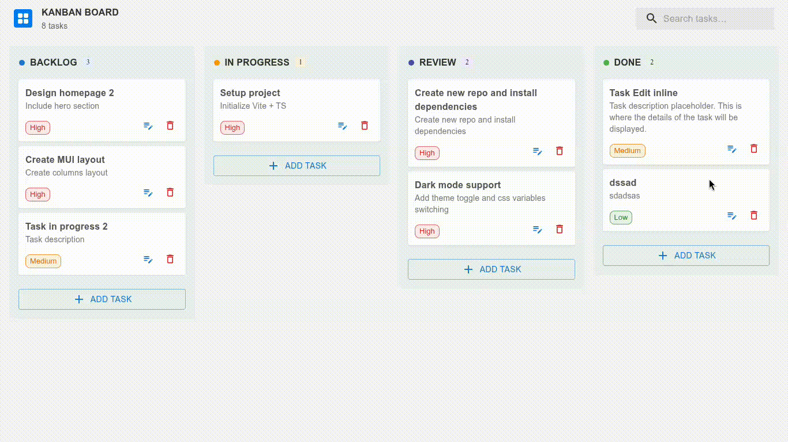

# Kanban ToDo Board – Frontend Developer Assessment

A modern **Kanban-style ToDo list dashboard** built for the Frontend Developer Assessment.

Implements 4 columns (Backlog, In Progress, Review, Done) with full **CRUD**, **search with debounce**, **drag & drop**, and **React Query caching**.

Live Demo: [https://kanban-board-mindluster-assessment.vercel.app](https://kanban-board-mindluster-assessment.vercel.app)  
(Backend mock API hosted separately on Vercel) via [json-server-template](https://github.com/Ahmed3zzeldeen/kanban-board-mindluster-assessment-server) but it's not fully functional due to Vercel's limitations on long-running processes. For local testing, run json-server locally as described below.



## Features Implemented
- 4-column Kanban layout (Backlog, In Progress, Review, Done)
- Create, Read, Update, Delete (CRUD) tasks
- Inline editing of tasks (title, description, priority, status)
- Global search by title or description (with 600ms debounce)
- Drag & drop tasks between columns using `@dnd-kit` (optimistic updates + real PATCH)
- Loading states, error handling, delete confirmation dialog
- Responsive design with Material UI (MUI)
- TypeScript + React Query for data fetching & caching
- Mock REST API using json-server

## Tech Stack
- **Frontend**: React 19 (Vite + TypeScript)
- **UI Library**: Material UI (MUI) + MUI Icons
- **State & Data Fetching**: TanStack React Query v5
- **Drag & Drop**: @dnd-kit/core + @dnd-kit/sortable
- **HTTP Client**: Axios
- **Mock Backend**: json-server (deployed to Vercel as serverless function)
- **Deployment**: Vercel (frontend + mock API)

## Project Structure
```
src/
├── components/           # Reusable UI components
│   ├── AddTaskDialog.tsx
│   ├── DeleteConfirmationDialog.tsx
│   ├── SearchAppBar.tsx
│   ├── TaskItem.tsx
│   └── TaskListContainer.tsx
├── hook/                 # React Query custom hooks
│   └── tasks.ts
├── lib/                  # Utilities
│   ├── api.ts
│   └── http.ts
├── types/                # TypeScript interfaces
│   └── index.ts
├── App.tsx
├── main.tsx
└── global.css
```

## How to Run Locally

### Prerequisites
- Node.js ≥ 18
- npm / pnpm / yarn

### 1. Clone the repository
```bash
git clone https://github.com/Ahmed3zzeldeen/kanban-board-mindluster-assessment.git
cd kanban-board-mindluster-assessment
```

### 2. Install dependencies
```bash
npm install
```

### 3. Start json-server (mock API)
```bash
npm run server
# Runs on http://localhost:4000
```

### 4. Start frontend dev server
```bash
npm run dev
# Runs on http://localhost:5173 (or similar)
```
Open [http://localhost:5173](http://localhost:5173) in your browser and start using the Kanban board!

## Deployment on Vercel
* **Frontend** is deployed to Vercel with production API base URL set via environment variable.
* **Backend (json-server)** is deployed separately as a serverless function using [this template](https://github.com/kitloong/json-server-vercel) but is not fully functional due to Vercel's limitations on long-running processes. For a fully functional backend, consider deploying json-server on a platform that supports persistent processes (e.g., Heroku, Railway) and update the `VITE_API_URL` accordingly.

### To link your deployed frontend to your backend API, follow these steps:
1. copy `.env.example` to `.env` and update the API URL:
2. set the `VITE_API_URL` to your deployed json-server URL like:

```env
VITE_API_URL=https://your-json-server-name.vercel.app
```

## Screenshots 📸
### 1. Full board view     


### 2. Inline editing + priority/status change  


### 3. Search + filtered results  


### 4. Drag & drop in action  


